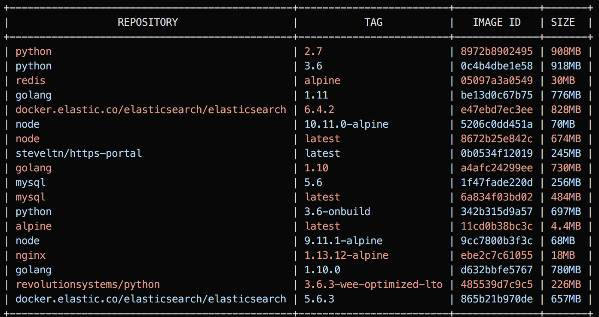

color docker  

--



colordocker is commnad line tool that color output docker command.

## Instalation

```bash
go get -u github.com/po3rin/colordocker/cmd/cdocker
```

## How to use

list containers.
```
$ cdocker ps
```

list images.
```
$ cdocker images
```
